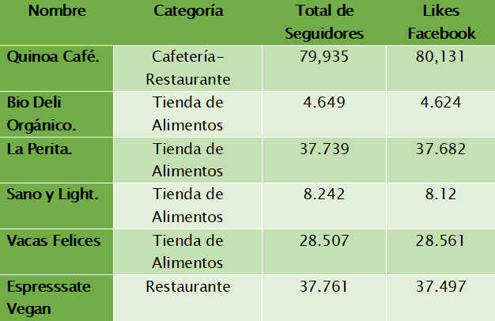
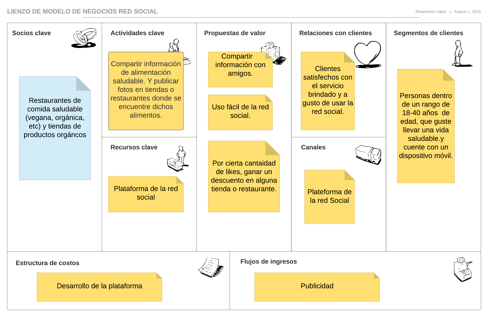
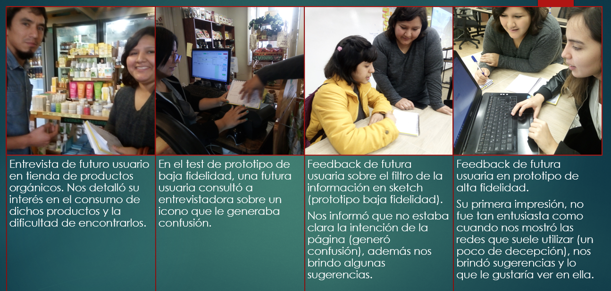

#  Red Social : Healthy Food
Healthy Food es una red social cuyo objetivo es que los usuarios recomienden recetas, tiendas, productos, restaurantes que ofrescan productos o servicios de alimentación saludable. Además de compartir los beneficios de llevar una alimentación saludable. 

### UX

Según el diario La República, en un estudio realizado por  las plataformas We are Social y Hootsuiteen en enero del 2018, las redes sociales más usadas en el Perú son Facebook con el 68% e Instagram 13% de todo el Perú. Siendo Facebook la red social mas preferida por los varones e instagram la red social mas preferida por mujeres.

A continuación ranking por edades de usuarios que prefieren Facebook:
1. Varones entre 18 y 24 años
2. Varones entre 25 y 34 años
3. Mujeres entre 18 y 24 años 
4. Mujeres entre 25 y 34 años
5. Varones entre 35 y 44 años
6. Varones y Mujeres entre 13 y 65 a más años
[_Fuente_](https://larepublica.pe/sociedad/1198456-peru-en-redes-sociales-2018-parte-i) 

Según la página Tendencias Digitales, de un estudio de usos de Internet en Latinoamérica 2016,  se tiene la siguiente información:

Lo que más le gusta hacer a los peruanos en las Redes Sociales	son:
1. Chatear	70%
2. Leer publicaciones	69%
3. Hacer comentarios	55%
4. Publicar fotos	50%
5. Compartir contenido	48%
6. Saber que hacen sus amigos	45%
[_Fuente_](https://tendenciasdigitales.com/internet-y-los-medios-sociales-en-peru/)

<!-- 
 -->
Por lo cual concluimos que nuestro producto estará orientado a un publicó entre las edades de 18 a 34 años.

##  Benchmark

Realizando el benchmark de las redes sociales más populares en el Perú con enfoque a la alimentación saludable, vemos que existen pocas páginas web exclusivas para este ámbito, sino que en su gran mayoría son grupos de Facebook o cuentas de Instagram que aprobrechan esas plataformas para transmitir información y generar un beneficio. Por lo cual vemos una buena oportunidad para emprender una red social exclusiva. 

A continuación una lista redes sociales del Perú con el enfoque a comida saludable:

1. fitnesscornerperu (Instagram)
2. The Fitness Corner (Facebook)
3. datofit_lifestyle (Instagram)
4. DatoFIT (Facebook)
5. fitadvisor.pe (Instagram)
6. [_Lima Orgánica_](https://www.limaorganica.pe)
7. limaorganicaperu (Instagram)
[_Fuente_](https://peru21.pe/vida/vida-saludable-conoce-paginas-facebook-comparten-consejos-vida-saludable-393140)
    * **Tabla de las estadísticas en redes de los principales negocios**
        
        

    * **Modelo de Negocio de empresas en el rubro de Alimentación Saludable**

        

Revisando a nuestras competencias podemos concluir que nuestra página tiene que tener una interfaz común o similar a las redes sociales de Facebook e Instagram, para que al usuario se le haga más familiar. A la vez observamos que debe tener un área para que en usuario comente.
En el siguinte link se observará las preguntas que se hizo el grupo de trabajo para la [_definición del producto._](https://docs.google.com/document/d/1q-1k9ianTY0HQ5LOBt10V5K4uRi4vdY1YQ5ix7Af2Ko/edit#heading=h.kjleo72egggi)
## Entrevistas con Usuarios
Cabe recalcar que el significado de las entrevistas es fundamental y que a menudo se pasa por alto, tienen un efecto importante en la calidad resultante del diseño final del producto, las entrevistas nos ayudan de tal manera que no tan sólo nos permite crear algo que solucione el problema sino de entender el problema tan bien que la solución es obvia. 

### Primera Etapa
En esta etapa se entrevistó a los futuros usuarios con una [_Guía de Preguntas_](https://docs.google.com/document/d/1IVTIRscBjaOJ-iRdKuzheZZGPZMZa_wzOBlvBLzHWZI/edit) que sirvió de base para la fluidez de la entrevista, consultando sobre su estilo de vida alimentacia, obteniendo así respuestas con un factor común (necesidad a cubrir).

### Segunda Etapa
Luego de la comprensión del problema a resolver y la interpretación de las necesidades se procede con la arquitectura de la información documentada.
#### **Sketch**
Al desarrollar el prototipo del producto basado en la información adquirida a través de la investigación de usuarios nos permite evaluar su efectividad de los mismos con los futuros usuarios e identificar problemas antes de llevar a producción. A continuación los grados de efectividad de los wireframes.

* **Prototipo de baja fidelidad:**
Nos ayudó principalmente a plasmar las primeras ideas y los primeros ajustes sin invertir demasiado detalle y tiempo. en el siguiente link se aprecia las versiones Desktop y móvil.
([_Prototipo desktop y móvil_](https://photos.app.goo.gl/nQPVMFpoaJMcFJB56)).

* **Prototipo de alta fidelidad:**
Aquí definimos los aspectos visuales que le darán identidad al producto: Paletas de colores, tipografías, iconografía, jerarquía.
([_Prototipo desktop_](https://photos.app.goo.gl/LK6beUtECnkQMe2t8),
[_Prototipo móvil_](https://photos.app.goo.gl/hbkuo1R4c9dqxEno9)).

### Tercera Etapa
Luego de materializar las ideas, prototipar la información se procede a medir y a evaluar la entrega.

#### Test a Usuarios:
* **Test al prototipo de baja fidelidad:**
La primera observación que nos realizó el usuario era que no podia saber de que se traba la página web,además de que no tenia un nombre, nos sugirió que coloquemos una pequeña descripción sobre  de qué se trataba nuestra página. A continuación el link del test del prototipo de baja fidelidad
[_Testing_](https://photos.google.com/share/AF1QipPm7NAYRf9lmHNrsHrikDCPT6RHwCWyYppWygm07W-839A3IhlkHyFnOlnyN68Zow?hl=es-419&key=QTRtdVExYjBCYjl0SGhjQ3RDZGFhQl9JUGtXWHln)

* **Test al prototipo de alta fidelidad:**
En esta fase el usuario no pudo entender a simple vista de que se trataba los iconos de logueo además resaltó la falta de impresión visual (es decir no capturaba su atención a primera vista.)
[_Testing_](https://photos.google.com/share/AF1QipMfDsMHE51F6IcZpFUbhM585kn1Bg9MCkBO_8O8qJZ0OTjZ6lODx7SzrVvKRhiaXA?hl=es-419&key=S2lFSjZFVzVTZmJXZnAxSFloOTd4VFd2TVQ4Q3lR)

**Conclusión:**

Para esta etapa se utilizaron las siguientes técnicas:
* Crítica de diseño con usuarios y clientes (Critic design).
* Pruebas con usuarios (User test).
* Monitorización o seguimiento visual (EyeTracking).

