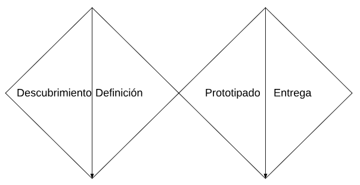
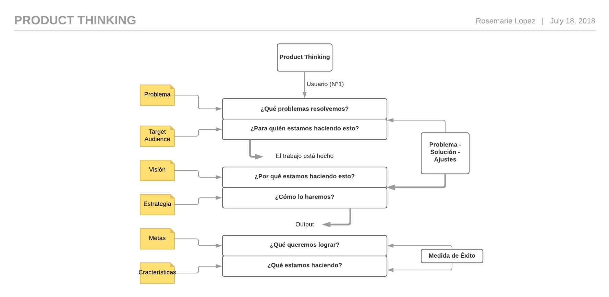
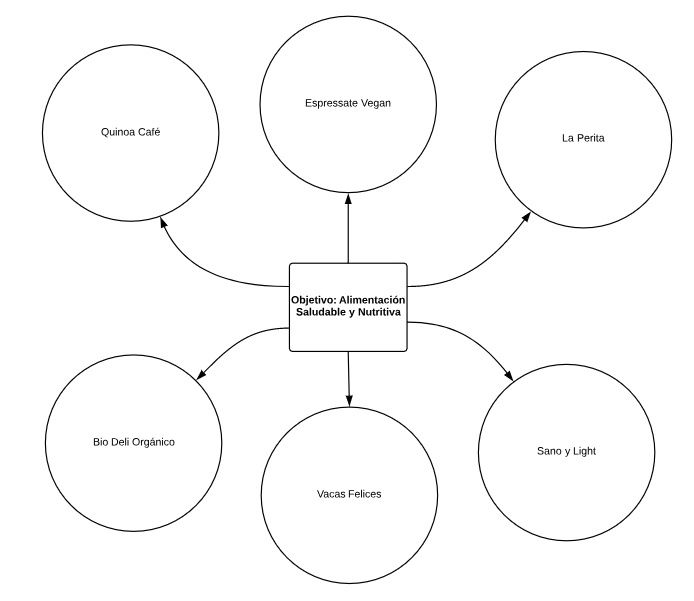

# Red Social: Healthy Food

## Alimentación

La salud y el buen funcionamiento de nuestro organismo, depende de la nutrición y alimentación que tengamos durante la vida. Alimentación y Nutrición aún cuando parecieran significar lo mismo, son conceptos diferentes.
Los objetivos nutricionales tienen como finalidad promover la salud, reducir el riesgo de desarrollar patologías relacionadas con la alimentación y controlar enfermedades específicas causadas por una ingesta excesiva o insuficiente de ciertos alimentos.
Para lograr tener una alimentación equilibrada debes incluir hidratos de carbono, proteínas, grasas, vitaminas y fibras. Cada uno de estos elementos es parte de la [_Pirámide Alimenticia_](https://do1pouckcwxot.cloudfront.net/mexico/uploads/2018/02/17162821/piramide1.jpg), pero no todos deben ser consumidos en cantidades iguales.

## Healthy Food

Healthy Food es una red social creada en base a la necesidad de brindar a los futuros usuarios las herramientas necesarias para inclinar su [_balanza alimenticia_](http://blog.pindapps.com/wp-content/uploads/2012/12/balanza.png) hacia lo saludable y con un alto valor nutritivo.

La salud y el buen funcionamiento de nuestro organismo, depende de la nutrición y alimentación que tengamos durante la vida, aún cuando parecieran significar lo mismo, son conceptos diferentes.
Ok, y esto qué tiene que ver con nuestra red social?, pues bien como lo hemos mencionado al inicio de esta breve introducción, Healthy Food es una red social que busca dar una **solución inmediata a las incertidumbres constantes de muchos** cuando de comer se trata. 

Existe un gran número de personas que tienen problemas de alimentación dentro los cuales se encuentra nuestro público objetivo, cuyas edades oscilan entre los dieciocho y cuarenta años, quienes ingresan con mayor frecuencia a las redes sociales en búsqueda de recetas fáciles de preparar con insumos económicamente accesibles y de temporada o lugares(Tiendas/Restaurantes) donde los puedan conseguir.

El proceso de diseño se basó en las siguientes etapas:

_1. Descubrimiento_

   * Se parte de una idea inicial
   * Se identifica la necesidad/oportunidad
   * Investigacion (Research)
   * Comprensión del problema a resolver

_2. Definición_

   * Interpretación de las necesidades
   * Arquitectura de la información

_3. Prototipado_

   * Materializar y ejecutar ideas
   * Prototipar Interacción

_4. Entrega_

   * Acabado del producto
   * Medición, Evaluación

# Benchmark
El benchmarking de las distintas Redes Sociales (análisis de la competencia) es una parte imprescindible que forma parte de todo Plan de Social Media, mediante este análisis determinamos qué prácticas están haciendo mal los competidores para no caer en ellas y, con qué prácticas están teniendo éxito para tenerlas en cuenta en nuestra estrategia de red social. No se trata de copiar lo que está haciendo la competencia, sino de aprender de ellos, tomarlos como referencia y conseguir alcanzar un alto nivel de competitividad.  A continuación el modelo de negocios de los principales negocios de alimentos saludables.

El **objetivo** común de los principales post de comida saludable en las diversas redes sociales existentes es demostrar el gran poder nutritivo y de calidad de los alimentos, que a su vez son de fácil adquisición y/o preparación, principal requisito para consumidores (usuarios). A continuación un listado de las principales Tiendas/Restaurantes con una gran cantidad de seguidores y mayor número de likes.

## Entrevistas con Usuarios
Cabe recalcar que el significado de las entrevistas es fundamental y que a menudo se pasa por alto, tienen un efecto importante en la calidad resultante del diseño final del producto, las entrevistas nos ayudan de tal manera que no tan sólo nos permite crear algo que solucione el problema sino de entender el problema tan bien que la solución es obvia. 

### Primera Etapa
En esta etapa se entrevistó (_Guía de Preguntas_) a los futuros usuarios, consultando sobre su estilo de vida alimentaria, obteniendo así respuestas con un factor común (necesidad a cubrir).

### Segunda Etapa
Luego de la comprensión del problema a resolver y la interpretación de las necesidades se procede con la arquitectura de la información documentada.

#### Skech de baja fidelidad

### Tercera Etapa
Luego de materializar las ideas, prototipar la información se procede a medir y a evaluar la entrega.

Para esta etapa se utilizaron las siguientes técnicas:
* Crítica de diseño con usuarios y clientes (Critic design).
* Pruebas con usuarios (User test).
* Monitorización o seguimiento visual (EyeTracking).
