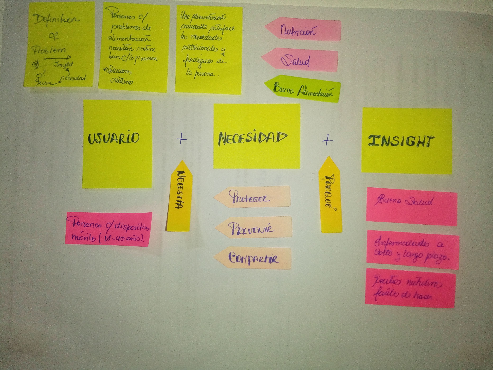
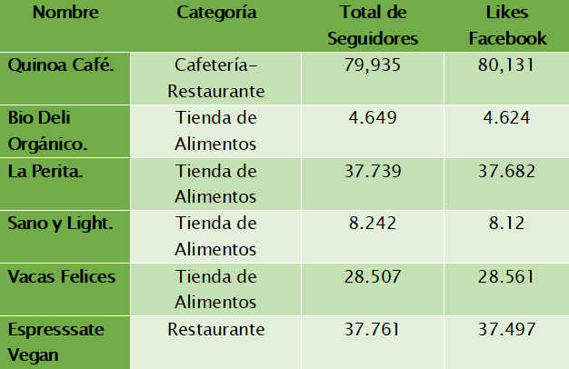
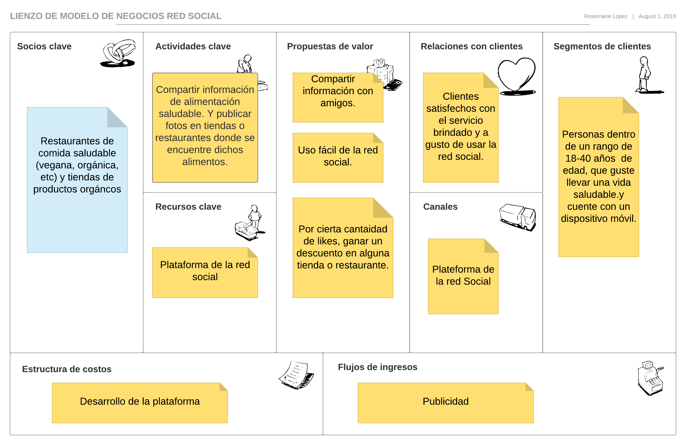
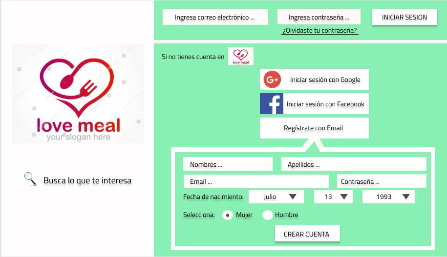
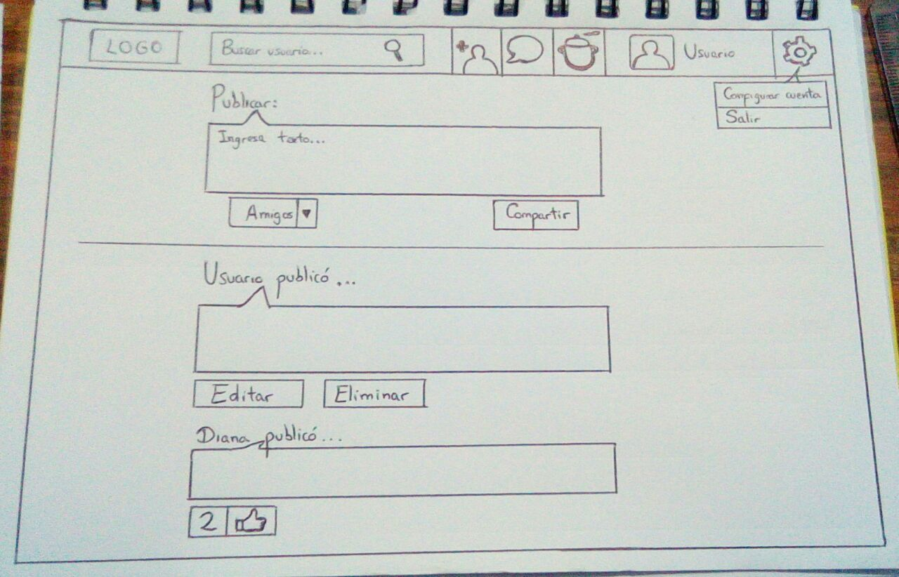
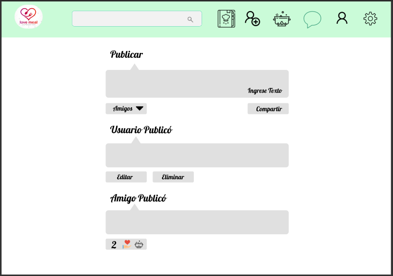
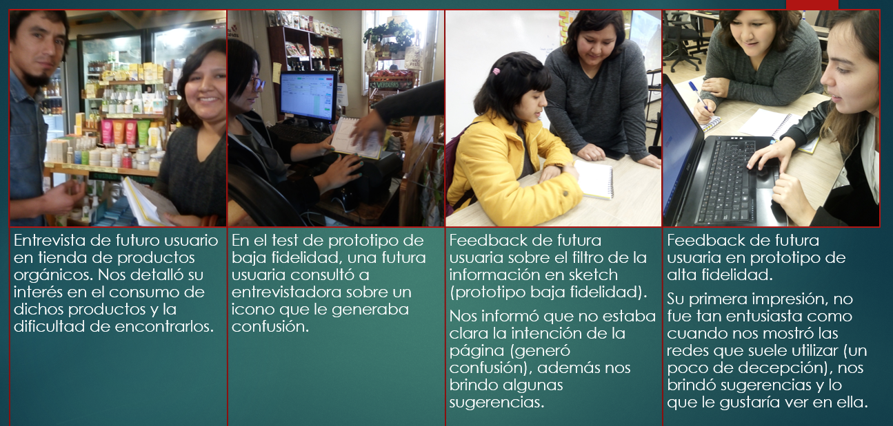

#  Red Social : Healthy Food
Healthy Food es una red social cuyo objetivo es que los usuarios recomienden recetas, tiendas, productos, restarurantes que ofrescan productos o servicios de alimentacion saludable.Donde su beneficio  se obtendra  principalmente de las publicidades.

### UX

Según el diario La República, en un estudio realizado por  las plataformas We are Social y Hootsuiteen en enero del 2018, las redes sociales más usadas en el Perú son Facebook con el 68% e Instagram 13% de todo el Perú. Siendo Facebook la red social mas preferida por los varones e instagram la red social mas preferida por mujeres.

A continuación ranking por edades de usuarios que prefieren Facebook:
1. Varones entre 18 y 24 años
2. Varones entre 25 y 34 años
3. Mujeres entre 18 y 24 años 
4. Mujeres entre 25 y 34 años
5. Varones entre 35 y 44 años
6. Varones y Mujeres entre 13 y 65 a más años
[_Fuente_](https://larepublica.pe/sociedad/1198456-peru-en-redes-sociales-2018-parte-i) 

Según la página Tendencias Digitales, de un estudio de usos de Internet en Latinoamérica 2016,  se tiene la siguiente información:

Lo que más le gusta hacer a los peruanos en las Redes Sociales	son:
1. Chatear	70%
2. Leer publicaciones	69%
3. Hacer comentarios	55%
4. Publicar fotos	50%
5. Compartir contenido	48%
6. Saber que hacen sus amigos	45%
[_Fuente_](https://tendenciasdigitales.com/internet-y-los-medios-sociales-en-peru/)

Por lo cual concluimos que nuestro producto estará orientado a un publicó entre las edades de 18 a 34 años.

##  Benchmark

Realizando el benchmark de las redes sociales más populares en el Perú con enfoque a la alimentación saludable, vemos que existen pocas páginas web exclusivas para este ambito, sino que en su gran mayoria son grupos de Facebook o cuentas de Instagram que aprobrechan esas plataformas para transmitir información y generar un beneficio. Por lo cual vemos una buena oportunidad para emprender una red social exclusiva. 

A continuación una lista redes sociales del Perú con el enfoque a comida saludable:

1. fitnesscornerperu (Instagram)
2. The Fitness Corner (Facebook)
3. datofit_lifestyle (Instagram)
4. DatoFIT (Facebook)
5. fitadvisor.pe (Instagram)
6. [_Lima Orgánica_](https://www.limaorganica.pe)
7. limaorganicaperu (Instagram)
[_Fuente_](https://peru21.pe/vida/vida-saludable-conoce-paginas-facebook-comparten-consejos-vida-saludable-393140)

Revisando a nuestras competencias podemos concluir que nuestra página tiene que tener una interfaz comun o similar a las redes sociales de Facebook e Instagram, para que al usuario se le haga mas familiar.A la vez observamos que debe tener un area para que en usuario comente.

### Sketch 

**Test de nuestra Primera interfaz:**
La primera observación que nos realizo el usuario era que no podia saber de que se traba la página web,además de que no tenia un nombre, nos sugirio que coloquemos una pequeña descripción sobre  de que se trataba nuestra página.

**Test de nuestra Segunda interfaz:**
El usuario no pudo entender a simple vista de que se trataba ls iconos de la parte superior.

## Entrevistas con Usuarios
Cabe recalcar que el significado de las entrevistas es fundamental y que a menudo se pasa por alto, tienen un efecto importante en la calidad resultante del diseño final del producto, las entrevistas nos ayudan de tal manera que no tan sólo nos permite crear algo que solucione el problema sino de entender el problema tan bien que la solución es obvia. 

### Primera Etapa
En esta etapa se entrevistó (_Guía de Preguntas_) a los futuros usuarios, consultando sobre su estilo de vida alimentaria, obteniendo así respuestas con un factor común (necesidad a cubrir).

### Segunda Etapa
Luego de la comprensión del problema a resolver y la interpretación de las necesidades se procede con la arquitectura de la información documentada.
### Tercera Etapa
Luego de materializar las ideas, prototipar la información se procede a medir y a evaluar la entrega.

Para esta etapa se utilizaron las siguientes técnicas:
* Crítica de diseño con usuarios y clientes (Critic design).
* Pruebas con usuarios (User test).
* Monitorización o seguimiento visual (EyeTracking).

### Cuestionario
1. Cuáles son los elementos básicos que tiene una red social.
    Tienen un registro e inicio de sesion del usuario, podemos postear contenido (videos, imagenes, comentarios) , podemos responder  post, agregar amigos, recibir notificaciones.

2. Quiénes son los principales usuarios de producto.
    Usuarios entre las edades de 18 a 44 años.

3. Cómo descubriste las necesidades de los usuarios.
    Realizamos búsqueda de estadísticas acerca de los usuarios que acceden a las redes sociales y entrevistas personales.

4. Qué problema resuelve el producto para estos usuarios.
    Los usuarios pueden encontrar encontrar recomendaciones de restaurantes, comentarios sobre servicios exclusivamente de alimentación saludable.

5. Cuáles son los objetivos de estos usuarios en relación con el producto.
    Recomendar recetas, restaurantes, tiendas que les fueron útiles y comentar sobre otras posteadas por los demás usuarios.

6. Cuáles son las principales funcionalidades del producto y cuál es su prioridad.
    Las funcionalidades del producto son:
    - Validaciones de usuarios (registro e inicio de sesion)
    - Posteo de recomendaciones
    - Comentar
    - Dar Like
    - Cerrar sesion
    La prioridad es de la funcionalidad es compartir informacion con el post.

7. Cómo verificaste que el producto les está resolviendo sus problemas.
    Porque no existen redes sociales exclusivamente sobre alimentacion saludable, generalmente los usuarios abren grupos o cuentas en facebook e Instagram.

8. Cómo te asegurarás que estos usuarios usen este producto.
    Mediante un seguimiento de cuantos usuarios por dia se registran o visitan  la página. Si la visitan y no regresan encontrar la razón.